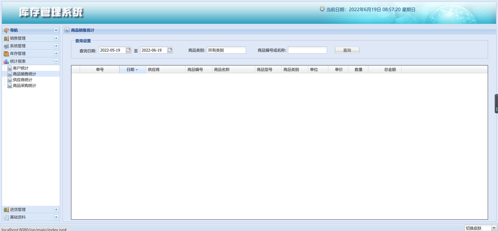

<h1 align="center">库存管理系统2</h1>

## 简介
库存管理系统2：采用蓝绿色渐变的现代科技感设计，突出全球连接与信息技术创新，适用于库存管理中的管理员和用户操作界面。    --计算机毕业设计源码；毕设源码；java毕业设计源码

## 联系方式

<h3 align="center">获取完整代码与数据库文件 + 微信：deepguan QQ: 86050149 QQ群: 783742310</h3>

<h3 align="center">可帮忙远程部署 包运行成功！提供远程部署、修改代码、设计文档指导、代码讲解等服务！</h3>

## 功能介绍（完整见运行截图）
管理员：基本功能包括登录、注册和退出，首页包含主导航栏、商品推荐和相关政策展示。商品模块支持商品列表展示、搜索、详情查看、购物车管理、结算和模拟在线付款。额外功能有店铺展示、政策推广和用户爱心志愿活动参与。个人中心允许管理员查看和修改个人信息，查询订单、地址和用户收藏。
用户：基本功能同样包括登录、注册和退出。在首页，用户可以通过主导航栏访问商品推荐和相关政策信息。商品模块提供商品列表、搜索、详情浏览以及购物车和结算功能，同时支持模拟在线付款。用户还可以参与店铺活动和关注公益政策。个人中心让用户查看修改个人资料，管理订单、地址和收藏内容。

## 运行截图

本代码来源于网络,仅供学习参考使用!

